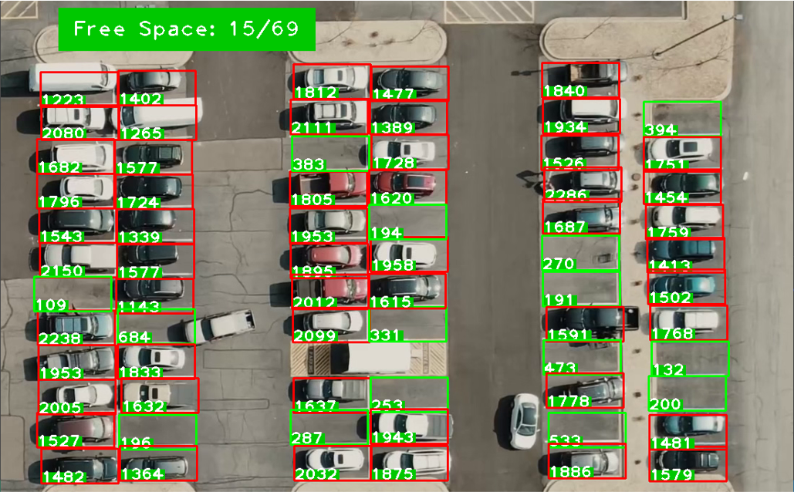
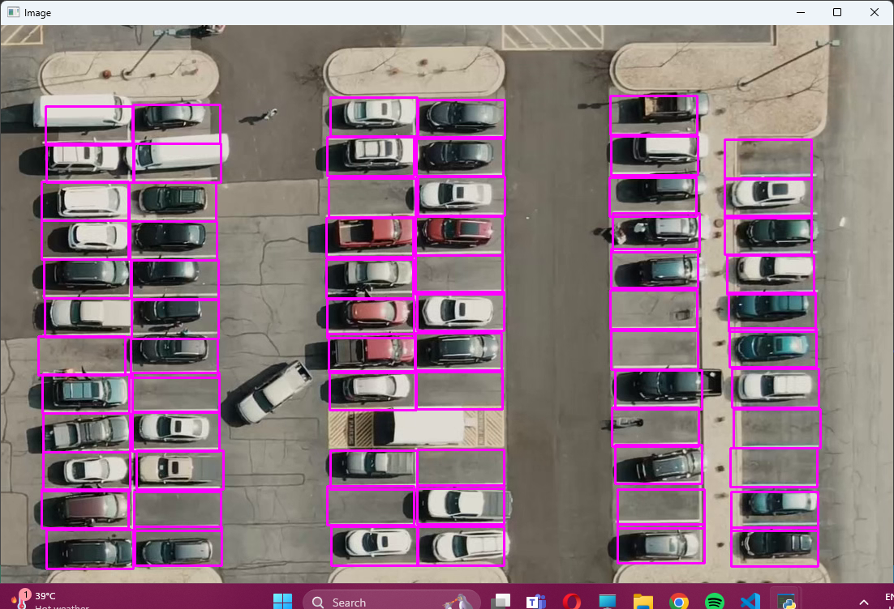
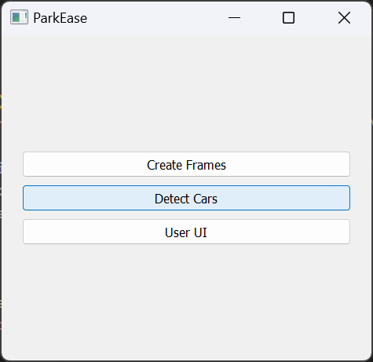

# ParkEase: Car Parking Assistant (A Computer Vision Project)

## Overview

ParkEase is a proof of concept (POC) computer vision project aimed at improving the parking experience by providing real-time information about available parking spaces. Using OpenCV, the system processes video feeds to detect cars and mark each parking space as occupied or available. This project is ideal for integration with existing CCTV systems to enhance parking management, particularly in large parking areas.

## Features

- **Real-time Car Detection**: Identifies and tracks cars in video feeds.
- **Parking Space Occupancy Detection**: Marks parking spaces as occupied or available with bounding boxes.
- **User-friendly Interface**: Displays the number of free slots available at a particular site.
- **Integration with CCTV Systems**: Enhances existing surveillance systems with smart monitoring capabilities.
- **Efficient Parking Management**: Suitable for large grounds or basement parking areas.

## Screenshots

Here are some screenshots demonstrating the features and functionality of ParkEase:

 
*Real-time car detection with bounding boxes.*

 
*Parking spaces marked as occupied or available.*

 
*Simple and easy UI to navigate.*


## Dataset

The dataset used for training includes images and videos captured from various parking areas. It features cars in different orientations, lighting conditions, and environments. Annotations indicate the ground truth bounding boxes for cars and parking spaces. Currently, the dataset is limited to three videos but may be expanded in the future.

## Installation

1. Clone the repository:
    ```bash
    git clone https://github.com/yourusername/ParkEase.git
    cd ParkEase
    ```
2. Install the required dependencies:
    ```bash
    pip install -r requirements.txt
    ```

## Usage

1. Place your video files in the `videos` directory.
2. Run the car and parking space detection script:
    ```bash
    python detect_parking.py
    ```
3. View the results, which will display the video with bounding boxes indicating occupied and available parking spaces.

## Challenges

- **Lighting Conditions**: Handling variations in lighting to ensure accurate detection.
- **Camera Angles**: Managing different camera angles for consistent performance.
- **User Interface Integration**: Creating an intuitive interface for easy interaction.

## References

- Zhang H., Wu C. (2018). "A Real-Time Parking Lot Occupancy Detection System Based on Deep Learning." IEEE Access 6: 10458-10468.
- P. Viola and M. J. Jones "Rapid object detection using a boosted cascade of simple features." CVPR 2001.
- S. Ren, K. He, R. Girshick, and J. Sun "Faster R-CNN: Towards Real-Time Object Detection with Region Proposal Networks." NIPS 2015.
- Redmon, Joseph, et al. "You only look once: Unified real-time object detection." CVPR 2016.

## Future Work

- **Real-time Video Analysis**: Implementing live video feed analysis.
- **Dataset Expansion**: Increasing the dataset size for better model training.
- **Enhanced Features**: Adding more advanced features for improved accuracy and usability.

## Contributors

- Pujan Gandhi (B.Tech. CSE)
- Hiya Shah (B.Tech. CSE)
- Ruhi Shah (B.Tech. CSE)

## License

This project is licensed under the MIT License. See the [LICENSE](LICENSE) file for more details.
